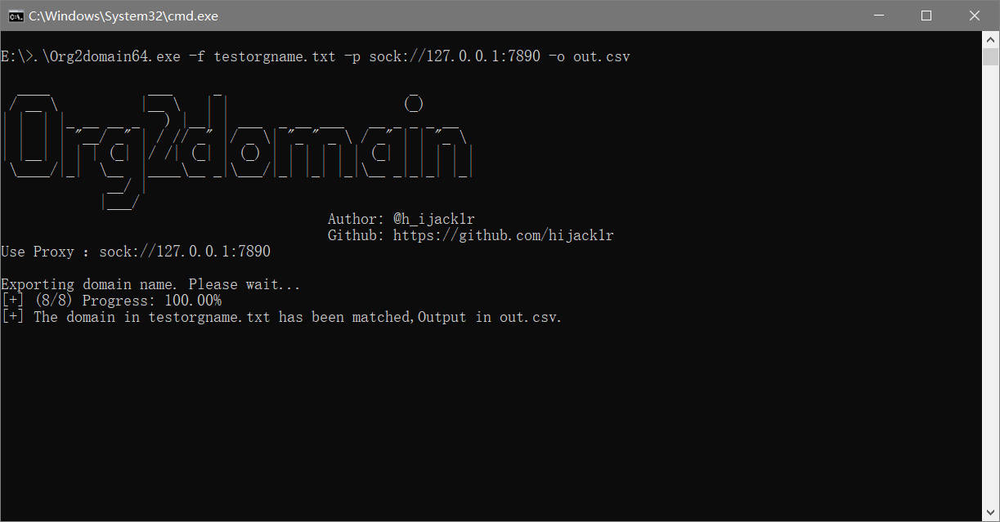
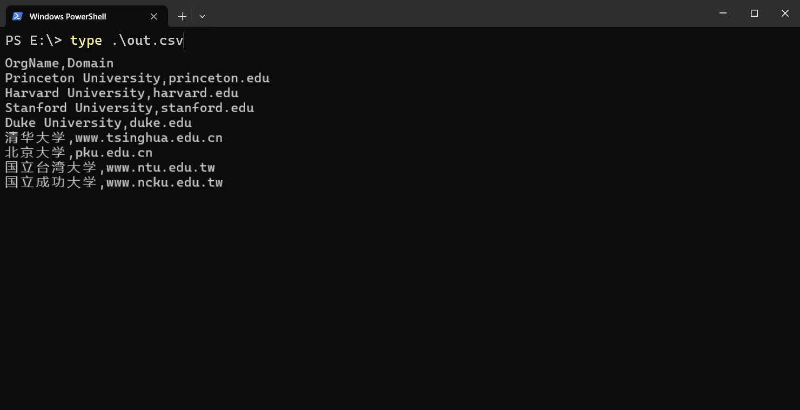

`Org2domain` is a quick primary domain name matching tool that can help you quickly find the primary domain name corresponding to your target organization. This tool is very suitable for penetration test learners. When your leader throws you an organization list, are you still manually looking for the completed primary domain name in your browser? Now `Org2domain` can take advantage of automation and large-scale, and you can take a leisurely sip of coffee. This tool is aimed at identifying nurses with Chinese and English organization names. The input organization names are not limited by language. 

[中文说明.md](README_cn.md)
# Usage
```shell
.\Org2domain64.exe -h
```
This will display help for the tool. Here are all the switches it supports.
```text
Usage:
  ./Org2domain64.exe [flags]

Flags:
  -h, --help  Help for Org2domain64
  -f string   File path of target file
  -p string   If need proxy to access Google, please set the proxy address
  -o string   Exported file name
  
  Such as:
  ./Org2domain64.exe -f OrgEn.txt -p http://127.0.0.1:7890 -o OrgEn.csv
```



# Declaration
Since this tool was written by staying up late for a short period of time, my mind is dizzy, and I expect there will be many mistakes. Welcome to point them out. This tool is for learning use only. If there is any illegal behavior in the process of using this tool, you will bear all the consequences.
